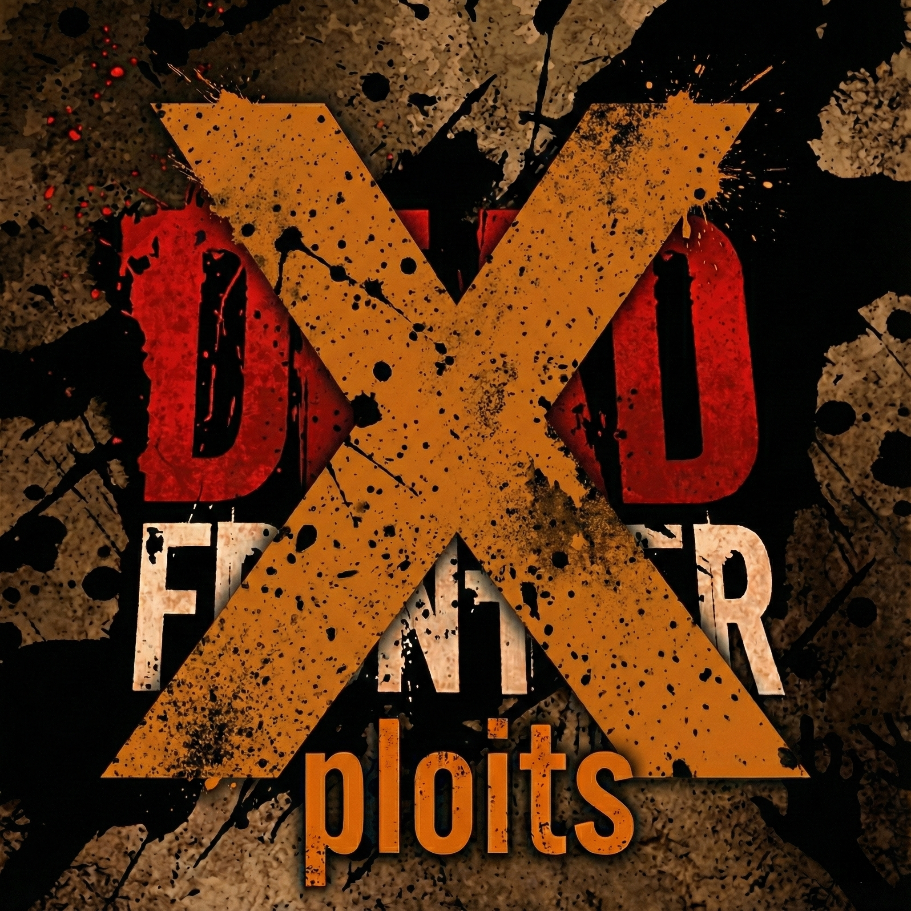

  

<h1 align="center">Dead Frontier Mod Menu</h1>

  

Mod menus for Dead Frontier 1 and Dead Frontier 2: movement, combat, world, and HUD enhancements.

**Disclaimer:** Use at your own risk. Not ban-proof; avoid main accounts. Enable only the mods you need. For personal use only.

---

## Setup

1. Install the launcher, purchase/validate your license, then click **Prepare** and launch the game.
2. **Required:** In your Dead Frontier install folder, right-click the game executable → Properties → Compatibility → check **Run as administrator** → Apply.

**Controls:** `F10` = Mod Menu · `F11` = Object Explorer (DF1). Keybinds are configurable in the Keybinds tab.

---

## DF1 (Dead Frontier 1) — Features

| Category | Features |
|----------|----------|
| **Player** | Infinite Sprint, Speed Multiplier, Noclip, Auto Loot Walker, Fast Loot Search, Lazy Loot (`;`), Cosmetic Customizer |
| **Loot** | Item filtering (ammo/food/cash/custom), Loot Status HUD, Radar, Nearest Loot Arrow |
| **World** | Visual Clarity, Camera FOV, Disable Weather, Instant Outpost, Disable Enemy/Weapon/Ambience Sound |
| **Combat** | One Hit Kill, Perfect Accuracy, Weapon Speed %, Never Reload, Auto Fire (`Ctrl+F`), Teleport to Crosshair, Bandit Calmer, Forcefield, No XP, Disable Aggro, Freeze Zombies, Dumb Enemies, Low Exploder/Spitter Radius |
| **HUD** | Loot Status, Radar, Loot Arrow, Keybinds Display, Filter Buttons, Hitmarker Crosshair, Pause When Menu Opens |
| **Tools** | Main Mod Menu (F10), Object Explorer (F11), Custom Keybinds, Security/Anti-Cheat Bypasses, Device Identifier Randomizer |

---

## DF2 (Dead Frontier 2) — Features

| Category | Features |
|----------|----------|
| **Player** | Speed Multiplier, Infinite Sprint, Noclip, Auto Puzzle, Fast Loot Search |
| **Combat** | Disable Enemy Targeting, One Hit Kill, ESP, Aimbot |

---

## Credits

Created by **glvckoma**.

## Legal

Software is provided "as is" with no warranty. You assume all risk (including account penalties or bans). No obligation to provide support or updates. Not affiliated with Creaky Corpse Ltd; game trademarks remain with their owners. Redistribution requires attribution to the source; commercial use prohibited. For educational use only; no unauthorized access, credential attacks, or ToS violation. Licensed under PolyForm Noncommercial 1.0.0. See LICENSE for full terms. Creaky Corpse Ltd may request takedown via this repository.
